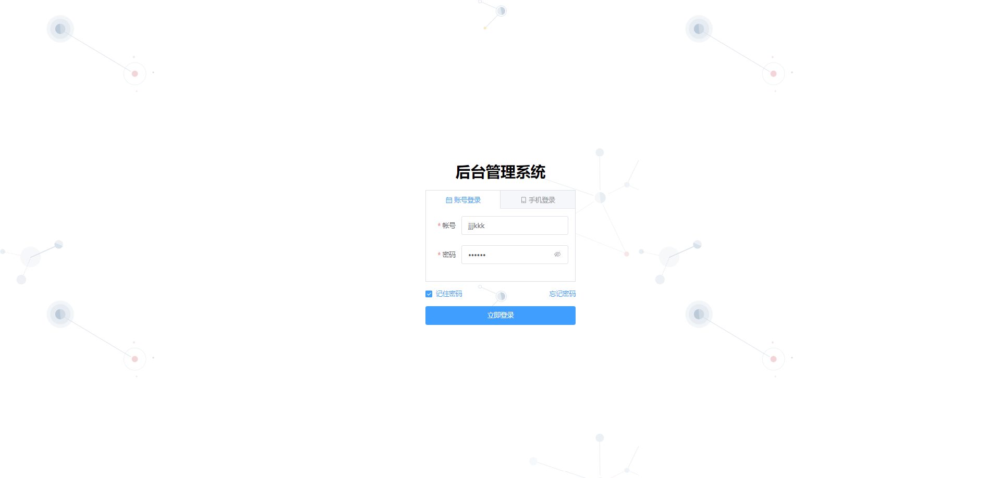
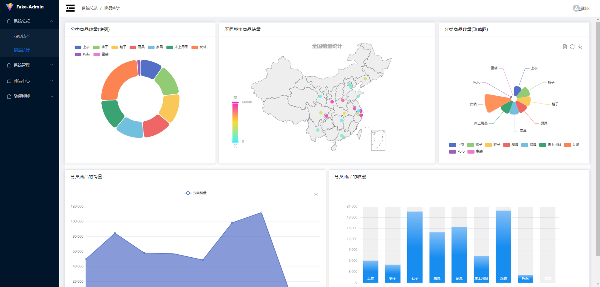
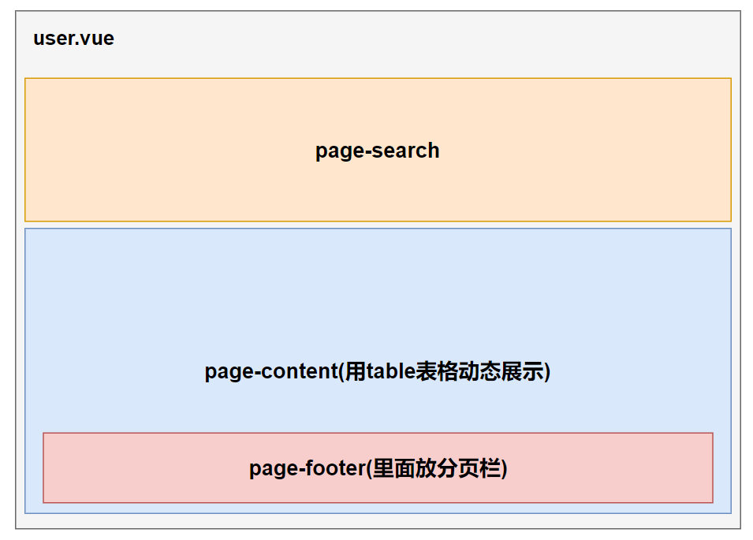
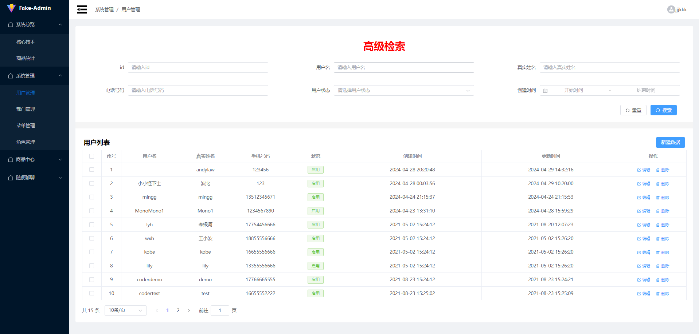
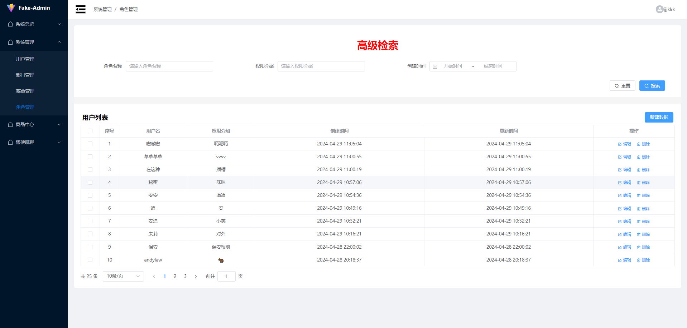
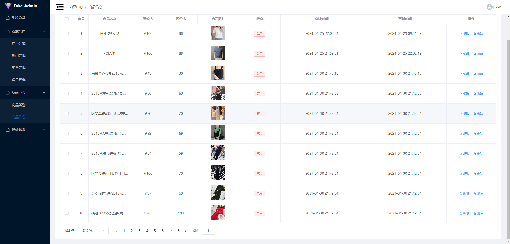

# fake-admin-system
一个检验学习成果的网页后台管理系统。实现了一些核心功能页面，剩下的页面等平时抽空做完。

技术栈：Vite+Vue3+TypeScript+Pinia+Axios+Element-Plus+Echarts：
* 使用Element-Plus组件库来设计页面的样式，对每个页面中重用的组件进行封装。
* 使用基于TypeScript的接口声明，对每个数据对象规范其内部数据类型，并通过编写配置文件config.ts的方式来导入所需要的属性，进而实现快速开发。组件内规范了想要调用的事件名称，使用emit来发送事件，父组件就监听emit并执行相应的函数。
* 使用自动化工具生成路由与组件的映射，并通过注册动态路由的方式，为不同权限的人员展示不同的导航菜单。
* 使用Pinia来对数据进行统一的管理，通过封装Axios实例来统一网络请求的接口。在Pinia中进行统一的数据请求，进而方便数据的统一获取以及组件的封装与复用。
* 通过封装与使用Echarts组件来对商品数量、销量、收藏量以及在不同城市的销量进行可视化实现。

代码规范工具：
* ESLint+Prettier规范代码格式。
* Commitizen+Commitlint+husky规范git commit时的注释格式。
  * 每次commit时就用`npx cz`来替代，而不用`git commit`，Commitizen提供了规范好的注释。
  * husky钩子用来检查在pre-commit时的代码格式是否准确，以及commit时的注释是否符合规范。

## 网页展示
由于是开发后台系统，有很多页面是相似的，所以像弹框、搜索框这些组件直接单独抽取了出来进行封装。对于每种数据类型使用interface规范其内容，进而使得可以通过编写配置文件的方式来实现组件的开发。

此外，使用coderwhy这个自动化工具来生成路由与view组件的映射。

对于每一个组件的文件，都使用以下方式进行管理，比如main组件文件夹内部：
* 创建src文件夹来存放每个与之相关的.vue文件。
* 创建index.ts来作为统一封装的出口。
* 如果有要规定数据类型的话，创建type.ts来规定interface。
### 登录页面
目前只实现了帐号登录。登录页面用一个login-panel组件进行管理，其中又分为login-account+login-phone两个tab：
* 记住密码、忘记密码和登录按钮都是放在外面的。
* 当点击登录时，login-panel内部获取login-account或login-phone这两个tab的ref，然后调用它们的登录方法来进行登录。
* 登录态使用JWT来实现：发送用户名和密码到服务端，然后服务端检验用户名和密码的正确性，并创建一个jwt做返回。
  * 这里为了使用方便就将token放到了pinia和localstorage中进行管理，并且封装了一个localstorage的工具类cache来方便调用localstorage。
  * 后续每次请求数据的时候就先从pinia中取出(如果没有就从localstorage中拿)并放到Authorization中。
* 不同权限的用户只能获得其对应的导航栏功能模块，这部分使用动态路由注册来实现。
  * 登录的时候后端会返回该用户所能使用的userMenus的路由。
  * 然后先拿到`/main`下的所有路由文件routes并加载，紧接着用userMenus的路由去匹配routes，如果匹配上就拿出routes中的route对象去addroute。※
  * 为了能在登录进入系统后，按f5刷新时也能获取路由，这部分的加载就放到了main.ts中，加载完后再进行app.use(router)。※

### 基于echart的商品统计页面
由于每个echart组件都是传入一个options来实现不同的样式的，所以就封装一个base-echart组件，不同样式的组件就使用写配置文件的方式来写options。最后要用的时候就import配置文件，然后v-bind到base-echart就能直接用。
* 对每个组件添加了对窗口resize的监听事件，在内部调用echart实例的resize()，进而让其echart的大小能随着窗口的缩放而缩放。
* 目前bar-chart有个bug，就是拿到数据后不会显示数据，而其他chart是可以的，我感觉像是这个echart组件有问题。

### 系统管理
#### 预设框架图

像"高级检索"、用户列表中的"表格"、"新建数据时的弹框"、"分页"这些都是重复组件，它们就额外抽出来作为单独组件进行封装。然后定义数据对象的interface，通过写配置文件config.ts的方式来导入所需要的属性，进而实现快速开发。组件内规范了想要调用的事件名称，使用emit来发送事件，父组件就监听emit并执行相应的函数。
* 在page-search中，点击搜索会重新发送请求去拿数据。里面所展示的输入框由配置文件动态插入，里面用colLayout来动态设置每一行放多少个输入框，然后用form-item来表示每个输入框的类型。
* page-content包括了table和分页栏
  * 在table中，会先判断当前用户的权限，然后来展示不同的可操作的按钮，比如右上角的"新建数据"，操作中的"编辑"和"删除"等。
    * 比如：像后端会返回来这种格式`system:menu:create`的字符串来表示当前用户的权限，那么就是允许在系统管理->菜单管理->创建新的菜单。
  * 编辑后或者删除后都重新发送请求来拿数据。
  * 分页组件中存储了当前页码currentPage与一页所展示的数量pageSize，使用v-model来在page-content中实现双向绑定。同时用watch监听这两个值的变化，如果变化了，就重新发请求拿数据。
* 在封装重复组件的时候，也对modal和search这两个组件的操作用函数做了封装，就是在里面封装了ref的引用，并且返回对按钮的操作方法。最后使用的时候直接进行v-bind就行。
  * 比如说，在usePageSearch()中，该方法会返回page-modal组件的引用，和reset+query查询的两个方法，最后在父组件中使用时只要将其绑定到Modal子组件上就行了。
#### 用户管理

#### 菜单管理

菜单管理就没有做新建和修改的按钮，这部分其实就是对应着左侧nav的menu，这部分是不变的。
#### 角色管理

角色管理的布局也是和一样的。

### 商品中心
#### 商品信息

这部分的布局也是跟系统管理的一样